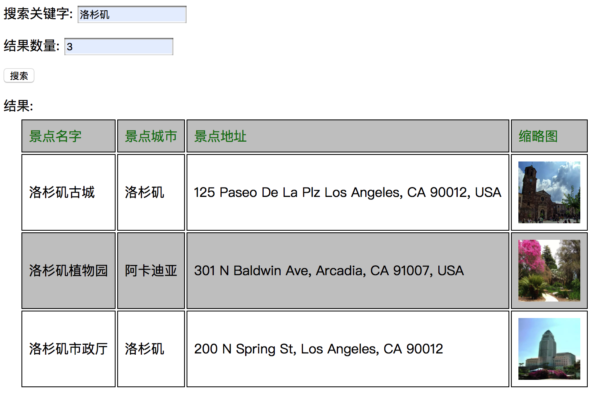
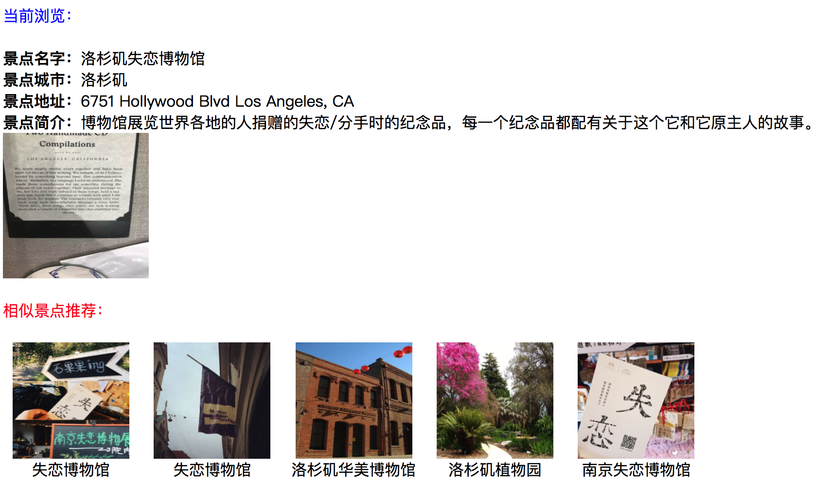

# K8S-ES-demo
Simple ES deployment on K8S


1. Build a Docker image(elasticsearch:7.5.0-poi-attraction)

2. Create K8S deployment
```bash
kubectl create -f deployment_es.yaml
```

3. Expose deployment port
```bash
sh expose_es.sh
```

4. Run Flask app
```bash
python app.py
```

5. Browse **localhost:5000**



6. Browse **localhost:5000/recommend** and search something like "洛杉矶失恋博物馆", here is the result page:



